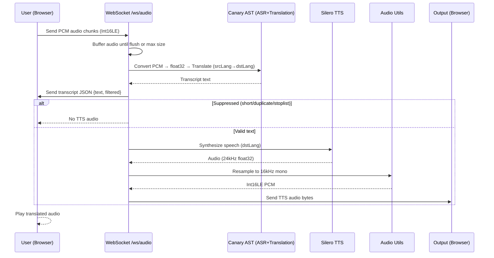

# Speech-to-Speech Translation Pipeline (Mermaid Diagram)



```mermaid
flowchart TD
    A[User Microphone] -->|PCM chunks| B[WebSocket /ws/audio]
    B -->|Buffer| C[Process & Respond]
    C --> D[Canary AST<br/>ASR + Translation]
    D -->|Transcript| E[Send JSON transcript]
    E -->|Filtered? | F{Suppressed?}
    F -->|Yes| G[Skip TTS]
    F -->|No| H[Silero TTS]
    H --> I[Resample 24kHz → 16kHz]
    I --> J[Convert float32 → Int16LE PCM]
    J --> K[Send audio bytes to client]
    K --> L[User hears translated speech]
